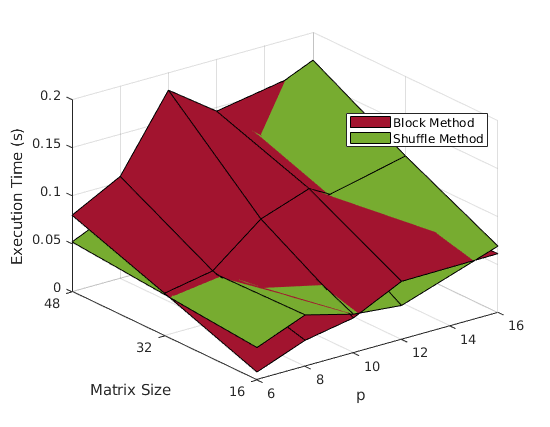
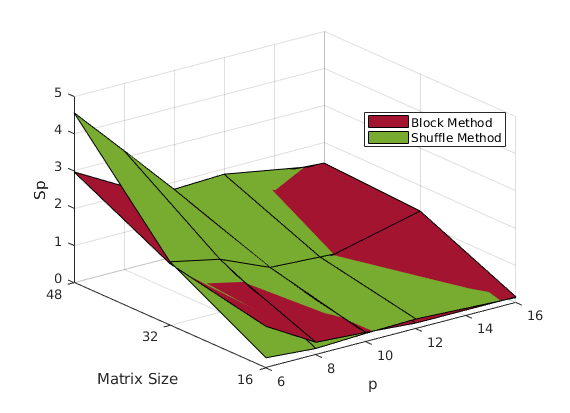
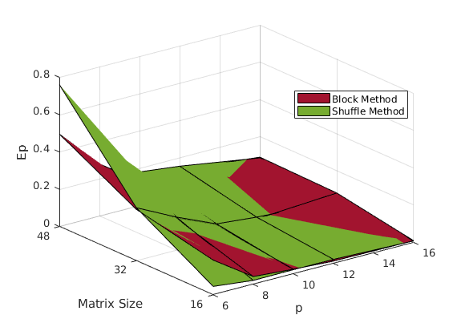
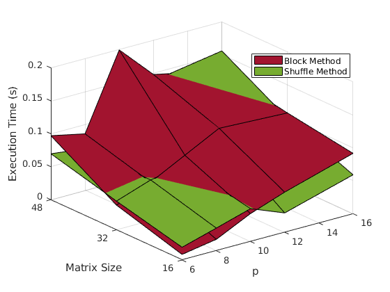
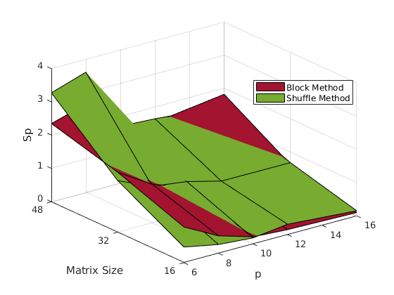
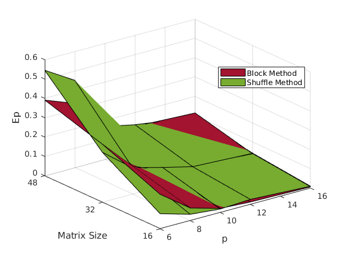
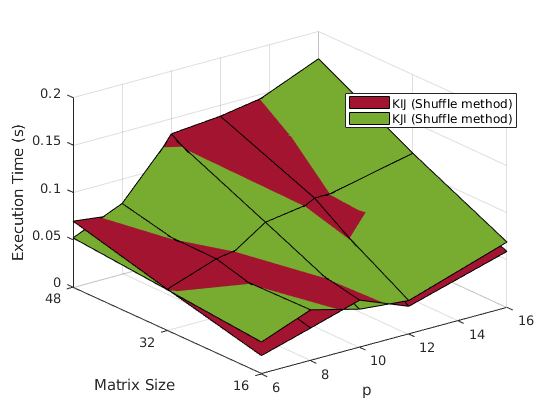
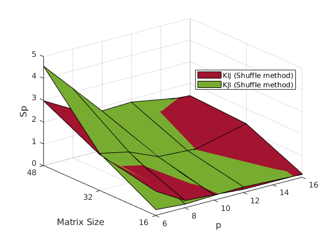
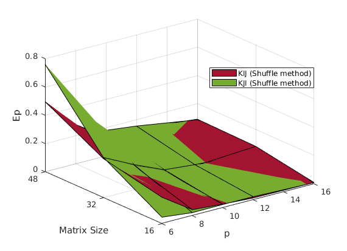

# ParallelGaussJordan-KJI-KIJ

Python scripts that implement the (parallel and serial) KIJ and KJI Gauss Jordan elimination methods to solve a linear system of equations.

## Gaussian Elimination

[Gaussian elimination](https://en.wikipedia.org/wiki/Gaussian_elimination) is a neat way to solve linear systems of equations. Typically, it goes like this:

```python
# Solving Ax=b using Gaussian elimination with partial pivoting
# Input: A: n x n matrix, b: vector of n dimensions
# Output: x: vector of n dimensions

Afull = stack(A,b) # A is now n x n+1, as we append b as a new column

for k=1:n do # traverse through columns of A

    # Find pivot (largest element of active column)

    pivot = Afull[k][k]
    pivot_row = k
    for i=k+1:n do
        if Afull[i][k] > pivot:
            pivot = Afull[i][k]
            pivot_row = k

    # Swap k-th row with row with the pivot element
    
    swap(Afull,k,pivot_row) # Afull[k][k] is now the pivot

    # Update bottom-right part of matrix

    for i=k+1:n:

        m = A[i][k]/A[k][k]

        for j=1:n+1 do:
            Afull[i][j] = A[i][j] - m*Afull[k][j]

# After this, A should be in upper diagonal form.
# Solving for x:

x[n] = Afull[n][n+1]/Afull[n][n]
for i=n-1:1 do:
    sum = 0
    for j=i+1:n do:
        sum = sum + Afull[i][j]*x[j]
    
    x[i] = (Afull[i][n+1] - sum ) / Afull[i][i]

# x now contains the solution of the system.

```

This algorithm has complexity of . However, execution time may be reduced by using parallelization.

## Gauss and Gauss-Jordan elimination
The result of the Gauss elimination is a matrix in upper diagonal form. In each step the bottom-right part of the matrix is updated. If we replace the `# Update bottom-right part of matrix` step with the following:

```
    # Update right part of matrix

    for i=1:n, i != k:

        m = A[i][k]/A[k][k]

        for j=1:n+1 do:
            Afull[i][j] = A[i][j] - m*Afull[k][j]
```

we end up with **Gauss-Jordan elimination**. Notice that we now update all of the rows, not just those rows "under" the active the pivot. The result of Gauss-Jordan elimination is a matrix in diagonal form.

## KJI and KIJ methods

There a ton of ways to parellilize this method, two of which are presented in this repo. 
The main idea behind these methods is to assign a number of columns to each
available processor, so that the computation of the bottom right part will happen in parellel. Of course, the task of selecting a pivot row will be processed by the processor responsible for the respective column.

My implementation of the both the KJI and KIJ methods can be summed up in this pseudocode:

```python
# This code is run in parallel by every processor.
# In order to avoid actuall swaps and save time, a pivot array is used.
# In short, it contains indexes of lines i.e. if pivot[0] is equal to 3,
# it means the line 3 is first.

for i=0:n:

    if I am responsible for the k-th column:

        # Find pivot
        pivot_pos = find_pivot(A,k)
        swap(pivot,pivot_pos,k)

        # Inform processors with columns after me about the swap
        for proc in next_procs:
            comm.Send(pivot)

        # Update my columns
        update_cols(A)

        # Send my columns to the next processors (next as in processors
        # that are responsible for columns with larger index than me)
        for proc in next_procs:
            comm.Send(update_cols)

        # Receive cols from other processors
        for proc in next_procs:
            comm.Recv(updated_cols)
            update_cols(A,updated_cols)

    else:

        # If this processor is not resonsible for any columns with larger
        # index than the active, then it is no longer needed.
        if k > max{col_indexes_that_i_am_resonsible_for}:
            exit()

        # Receive updated pivot array
        pivot = comm.Recv(pivot)

        # Update my columns
        update_cols(A)

        # Send columns to the next processors
        for proc in next_procs:
            comm.Send(update_cols)

        # Receive cols from previous processor (if they exist)
        for proc in next_procs:
            comm.Recv(updated_cols)
            update_cols(A,updated_cols)

```

One can easily note the three main for-loop variables used during the "update my columns" step: `i,j` and `k`. The names of the methods come from the order of the loop variables in the for-loops of the algorithm:

### KJI Method
```python
    for k in range(0,n):
    .
    .
    .

        for j in column_mapping[myrank]:
            
            if j > k: # We have to do calculations for columns right of the active column

                Afull[pivot[k]][j] = Afull[pivot[k]][j] / Afull[pivot[k]][k]

                for i in range(0,n):

                    if i != k :

                        Afull[pivot[i]][j] = Afull[pivot[i]][j] - Afull[pivot[i]][k] * Afull[pivot[k]][j]

```
### KIJ Method
```python
    for k in range(0,n):
    .
    .
    .

        for i in range(0,Afull.shape[0]):

            if i != k: # no need to update the column that the pivot is in

                for j in column_mapping[myrank]:

                    if j > k: # update columns right of the active column

                        Afull[pivot[i]][j] = Afull[pivot[i]][j] - Afull[pivot[i]][k] * Afull[pivot[k]][j]


```


## Column Assignment

Two columns assignment methods have been implemented:

1. Block method: Each processor is assigned  consequtive columns.

2. Shuffle method: The columnd of the input matrix are "dealt like cards" to processors. Lets say, for example, that A is a 10 by 10 matrix and we have 4 processors available: 

| Processors | Processor 1 | Processor 2 |  Processor 3 |  Processor 4 |
| --------  | -------- | -------- | -------- | -------- |
| Assigned Columns | 1,5,9|2,6,10|3,7,11*|4,8|

*Remember that we append vector b to A, thus increasing the total number of columns by 1.

## Results

In order to assess the performance of the implementation, 3 metrics will be used:

1. (Parallel) execution time
2. Speedup ()
3. Efficiency ()

### KJI Method





### KIJ Method





It should be evident by now that the shuffle method performs better. Although the block method is easy to understand and implement, after a while, it leaves most of the work left to the processors assigned columns with higher indices, thus creating a bottleneck.

### Comparing KJI and KIJ





The KIJ methods seems to perform a bit better (at least on the example data).